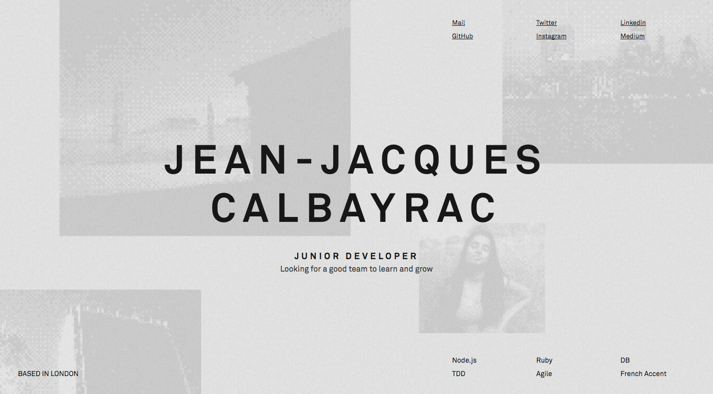

# Jean-Jacques Calbayrac

[About Me](#about-me) | [Projects](#projects) | [Skills](#skills) | [Experience](#experience) | [Education](#education)

<a name="website" href="http://calbayrac.one/" target="_blank"></a>

## <a name="about-me">About Me</a>

Welcome to a new chapter of my life.

After 5 years working in photography, I decided to change career. I've always been curious about coding and what a developer does. It looks like dark magic from the outside. And after an intensive and amazing three months at Makers Academy I'm finally ready for the next step.

In the past three months I worked on a lot of very different project, from hacking an Atari game using hexadecimal and Assembly code, to creating a VR experience using Alexa to direct you in the different VR scenes. Every challenge facing me was one more opportunity to prove that I made the right choice to change career.

On my spare time I started to work on small personal projects, I'm motivated to learn C# and for that I started created small video games on Unity, but I also want to reinforce my knowledge of JavaScript. My biggest problem? there are only 24 hours a day.

## <a name="projects">Projects</a>
------------

| [Invading the Invaders](https://github.com/gekographe/invading_invaders) | [Alexa Spaceship](https://github.com/nazwhale/spaceship) |
| :--------------- | :--------------- |
| Documentation created after learning how to hack a video game. Hacking and documentation made in 5 days with [Vivien Tang](https://github.com/honjintang), [Hasan Sonmez](https://github.com/UltimateCoder00) and [William Schwier](https://github.com/w-schwier).| Final Project of my 12 weeks experience at Makers Academy! And in 2 weeks we took up the challenge to learn new technologies, including Node.js, cloud services and programming for VR. We even were able to add a couple of extra features. I had the chance to work on this project with [Naz Malik](https://github.com/nazwhale), [Kate Gleeson](https://github.com/allbecauseyoutoldmeso) and [Ruan Odendall](https://github.com/ruanodendaal)

Web Development
---------------

I wrote my first line of code 5 months ago. I always wanted to learn about web development, but if I start something I go all
the way - so I attended Makers Academy for three months and, among many things, I figured out how to learn fast and be efficient with my time.

## <a name="skills">Skills</a>

#### Fast Learner
```
As a developer,
So that I can be quick and efficient,
I want to prove to my new employer that I can pick up new skills quickly.
```

- 3 months ago I started to study at Makers Academy.
  Today I know and use on a daily basis Ruby, JavaScript,
  use various frameworks to TDD my apps, and use ORMs to work with SQL databases,
  know and apply conventions like SOLID and REST.
- Personal projects gave me the occasion to learn in a week how to
  hack a game and learn about hexadecimal code. I also started to write code using Assembly.

#### Test-Driven Development
```
As a developer,
So that I can ship a great app,
I want to write great tests to make sure everything runs smoothly
```

- A great app is a tested app, working without testing might
  seem like a time-saving way of coding but in the long-term
  it's counterproductive.
- I'm trained to use RSpec, Jasmine and Cucumber
- I created my own JavaScript testing framework

#### Teamwork & Communication
```
As a developer,
So that I can deliver world-class software,
I would love to work in a team-driven environment.
```

- Communicating is one of the most important part of teamwork
  and it's important to keep this link intact by sharing knowledge
  through stand-ups, retrospectives and good use of feedback.
- I'm well-versed in pair-programming and enjoy it very much.
- Diagramming is a great way to explain your understanding of a system and I find it useful to explain my train of thoughts.

## <a name="experience">Experience</a>
```
As a developer,
So that I can provide a keen, fresh eye
I want my new team to know that I come from a different background
```

#### Makers Academy

- Makers Academy is a bootcamp but most importantly it's an experience
  that taught me what working in a challenging environment is like.
  Every week we had new challenges to face, and finding solutions to each
  of them was an amazing experience.

#### Photography

- Before starting my new exciting life as a junior developper
  I used to work in photography as a photographer's assistant.
  Photography is a creative but also a very competitive world
  with tight deadlines- I know what working under pressure means.
- I got the chance to work with great photographers like
  Paolo Roversi (Fashion photography) or Stanley Greene (War photography)
  and understand what working at the highest levels requires.

#### Apple Store

- I used to work in an Apple Store as a Specialist. It was a great experience
  where I learnt for the first time the concept of positive feedback, and got the opportunity
  to work in a big team and exchange with lots of people.

#### Bartender

- I also worked as a bartender in different places. I had to operate in
  a very fast environment where your team is _everything_. It also meant I had to quickly learn a lot of different aspect of bartending like:
  - cocktail recipes
  - be self-aware of my surroundings
  - become a good listener
  - also I pour a great beer, just to say

## <a name="education">Education</a>

#### Makers Academy

- Studied web development, and learnt how to learn quickly and effectively.

#### Gobelins, l'ecole de l'image - Paris

- Studied photography for 3 years, learning about lights, the technicals aspects of a shooting and I have great photoshop skills.

#### University of La Sorbonne - Paris

- Studied geography and geology for a year.

#### LISAA - Paris

- Studied art history for a year.

## A bit more

- I started a photography project using a [Gameboy Camera](https://www.instagram.com/gameboycameraman/). Instagram [shared](https://www.instagram.com/p/BKofrdFD4IF/) one of my pictures and I'm currently exhibiting a series of these photos in [The Hague Photography Museum](http://www.fotomuseumdenhaag.nl/en/exhibitions/gameboycameraman), in the Netherlands.

- I craft my own boardgames. It's a great way to learn how to solve problems and understand how to bring a project from scratch to a full-release version.
